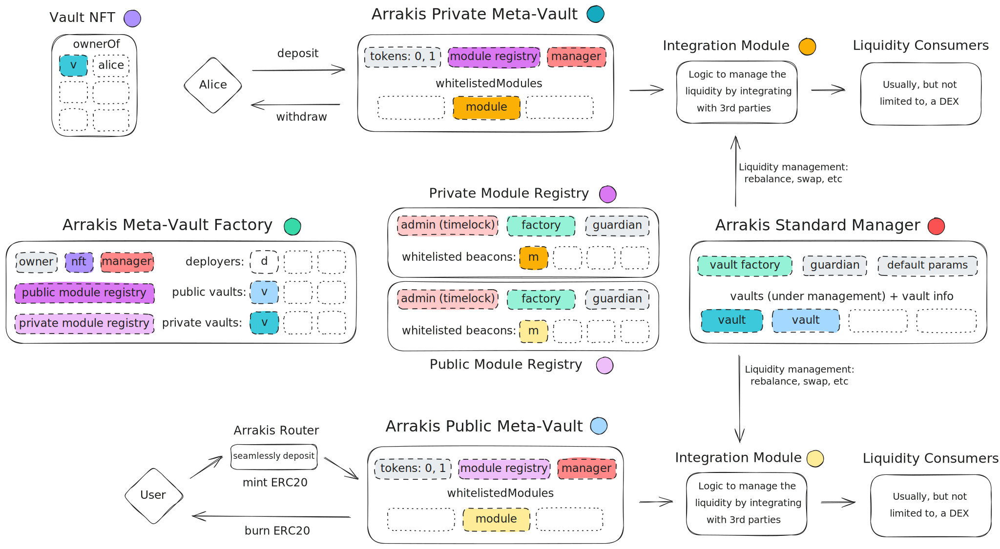

# Architecture

Arrakis V1 and V2 LP vaults were each constrained vault types entirely built around Uniswap V3 DEX.

Arrakis Modular takes the approach of creating an _Arrakis Meta Vault_ standard, where each vault attaches a _module_ adhering to a standard interface for integration with any underlying two-sided liquidity provision protocol(s). As long as a _module_ implements the module interface and its invariants correctly, it can be shipped and directly attached to the _Arrakis Meta Vault_ standard to create a new vault type / support a new LP vault use-case.

For now, the domain of use-cases considered for a _module_ could still all be integrations with a (single) DEX liquidity provision protocol, though technically modules could become more complex (a module that integrates with multiple DEXs simultaneously and can rebalance across them, or a module that integrates a DEX and peripheral protocols like lending markets or options protocols -- though this is all out of scope for now, it should be possible in theory).
