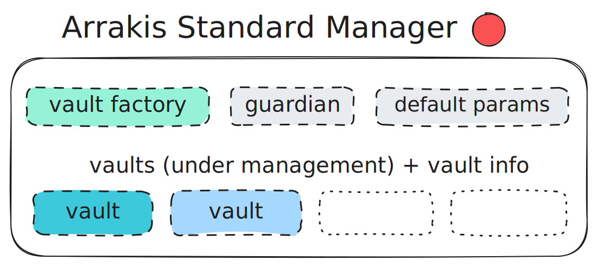

# Vault Configuration

Every Meta Vault has configurable components which can be adjusted by the Vault `owner` role. The two main configurables are:

1. **modules**: whitelisting and revoking _modules_ which each define the integration with an underlying liquidity protocol (e.g. HOT AMM module) and also expose certain liquidity management functions that can be invoked by the _Arrakis Standard Manager_.

2. **manager configuration**: set on the _Arrakis Standard Manager_, the vault owner controls the [VaultInfo](../../../autogenerated/structs/SManager.sol/struct.VaultInfo.md) struct including an `executor` who can call liquidity management functions for this vault from offchain, and safety checks on any liquidity management actions that the `executor` invokes.

### Configuration Management

The Meta Vault `owner` role has the ability to whitelist _modules_ and configure management parameters on the _Arrakis Standard Manager_. **This means a vault owner can entirely augment where vault liquidity flows, how it behaves, what management functions it exposes, and who can execute management functions.**

**All Public Vault ownership is immutably behind a multi-day timelock (controlled by the Arrakis DAO) so that LPs are guaranteed to have time to react to any changes in configuration.**

Private Vaults Ownership is mapped in the Private Vault NFT contract, and Private Vaults do not enforce a timelock on vault ownership (private vault liquidity providers are intended to be the owner of their private vaults).