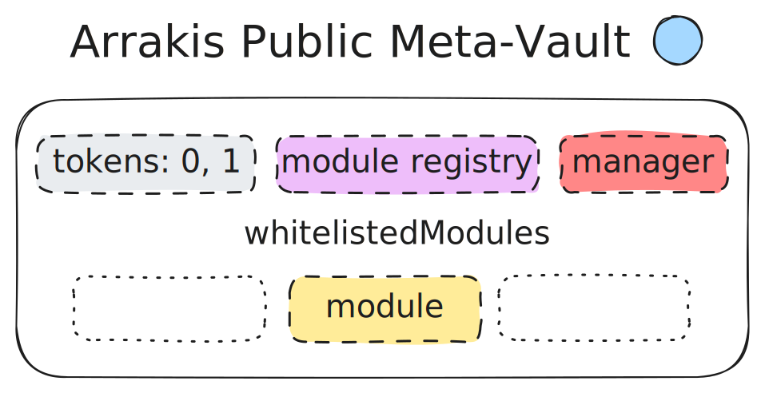

# Arrakis Meta Vault

Meta Vaults are a core component of the Arrakis Modular system, designed to provide a flexible and efficient way for users to manage liquidity across various decentralized exchanges (DEXs) and trading venues.

### Meta Vault Types
    

   
   

   1. **Public Meta Vaults**: These are ERC20-wrapped vaults intended for shared liquidity positions or strategies. They allow for delegated management of liquidity on behalf of multiple participants.

    

    
    

   2. **Private Meta Vaults**: These are designed for token issuers and individual users to manage or delegate management of their own private liquidity. The ownership and transfer rights of Private Meta Vaults is tokenized as a fully onchain NFT, as shown below.

    

    
    

## Deploying Vaults

The **Factory** is responsible for deploying new instances of both public and private Meta Vaults. Private vaults can be permissionlessly deployed by anyone while public vaults are only deployed and controlled by Arrakis DAO. The Factory contract maintains a list of all deployed vaults and manages permissions for public vault deployments.

This architecture allows for efficient liquidity management across multiple platforms while providing options for both shared and private liquidity strategies, all within a modular and extensible framework.
