# Arrakis Meta Vault

Meta Vaults are a core component of the Arrakis Modular system, designed to provide a flexible and efficient way for users to manage liquidity across various decentralized exchanges (DEXs) and trading venues. The key features and concepts of Meta Vaults include:

1. **Versatile Liquidity Provision**: Meta Vaults allow users to provide liquidity using two distinct assets across multiple trading platforms without the need to deploy or migrate funds to separate vaults for each platform.

2. **Modular Architecture**: The system uses a modular approach, where _modules_ (smart contracts) can be whitelisted to integrate with different liquidity-consuming decentralized applications (dApps). This modularity allows for easy expansion to new DEXs by simply creating and whitelisting new compatible modules.

3. **Two Types of Meta Vaults**:
    

   
   

   a. **Public Meta Vaults**: These are ERC20-wrapped vaults intended for shared liquidity positions or strategies. They allow for delegated management of liquidity on behalf of multiple participants.

    

    
    

   b. **Private Meta Vaults**: These are designed for token issuers and individual users to manage or delegate management of their own private liquidity. The ownership and transfer rights of Private Meta Vaults can be tokenized as a fully onchain NFT, as shown below.

    

    
    

4. **Factory**: It is responsible for deploying new instances of both public and private Meta Vaults. It maintains a list of all deployed vaults and manages permissions for public vault deployments.

This architecture allows for efficient liquidity management across multiple platforms while providing options for both shared and private liquidity strategies, all within a modular and extensible framework.
