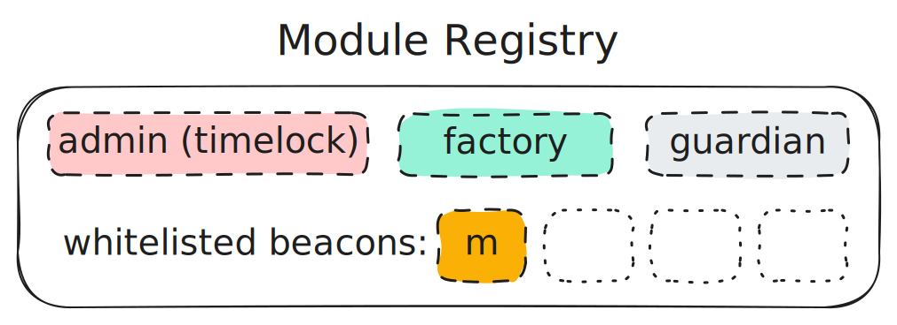

# Modules

Modules are smart contracts that act as a bridge between Meta Vaults and specific decentralized exchanges (DEXs) or liquidity protocols. They encapsulate the logic for interacting with particular trading venues, allowing Meta Vaults to provide liquidity across various platforms without changing their core structure.

Modules also each expose their own custom functions for liquidity management that only the `manager` of the Meta Vault can call.

Module implementations are whitelisted on public and private registry contracts to ensure security and proper functionality. The vault `owner` selects which module(s) to attach to their vaults. Each vault has exactly one "active" module and every vault has a `setModule` function which only the `manager` can call (to change the "active" module).

The key strength of modules lies in their flexibility and standardization. As new DEXs emerge or trading strategies evolve, new modules can be created and integrated seamlessly, enabling the Arrakis system to adapt to the rapidly changing DeFi landscape.

Explore module implementations built by Arrakis [here](../../modules/overview.md). Or check out the modules interfaces [here]()
