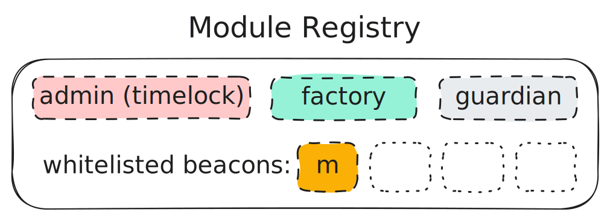

# Modules

Modules are smart contracts that act as a bridge between Meta Vaults and specific decentralized exchanges (DEXs) or liquidity protocols. They encapsulate the logic for interacting with particular trading venues, allowing Meta Vaults to provide liquidity across various platforms without changing their core structure.

These modules are whitelisted through public and private registry contracts to ensure security and proper functionality. While currently focused on single DEX integrations, the modular design allows for potential expansion into more complex scenarios, such as multi-DEX interactions or integration with other types of DeFi protocols.

The key strength of modules lies in their flexibility and standardization. As new DEXs emerge or trading strategies evolve, new modules can be created and integrated seamlessly, enabling the Arrakis system to adapt to the rapidly changing DeFi landscape.

You can explore some module implementations built by Arrakis [here](../../modules/overview.md).
