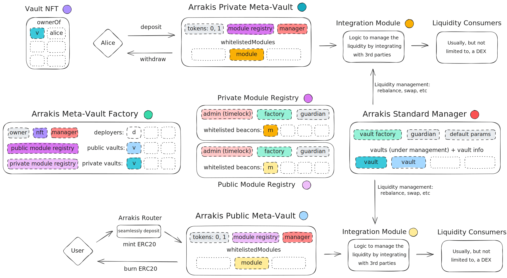

# Architecture

At the heart of the Arrakis Modular system is the concept of Meta-Vaults. These Meta-Vaults enable users wishing to provide liquidity with two distinct assets to do so across any trading venue—without the need to deploy or migrate funds to new vaults. Meta-vaults, or from now on simply _vaults_, have the capability to whitelist various _modules_, essentially smart contracts that establish integration with liquidity-consuming dApps. This design ensures that as new DEXs emerge, liquidity provision becomes a matter of simply creating and whitelisting a new module compatible with the DEX, and then activating it.

For now, the domain of use-cases considered for a _module_ could still all be integrations with a (single) DEX liquidity provision protocol, though technically modules could become more complex (a module that integrates with multiple DEXs simultaneously and can rebalance across them, or a module that integrates a DEX and peripheral protocols like lending markets or options protocols -- though this is all out of scope for now, it should be possible in theory).
