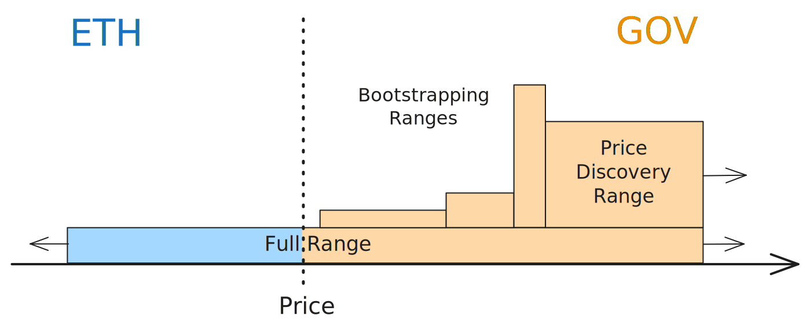
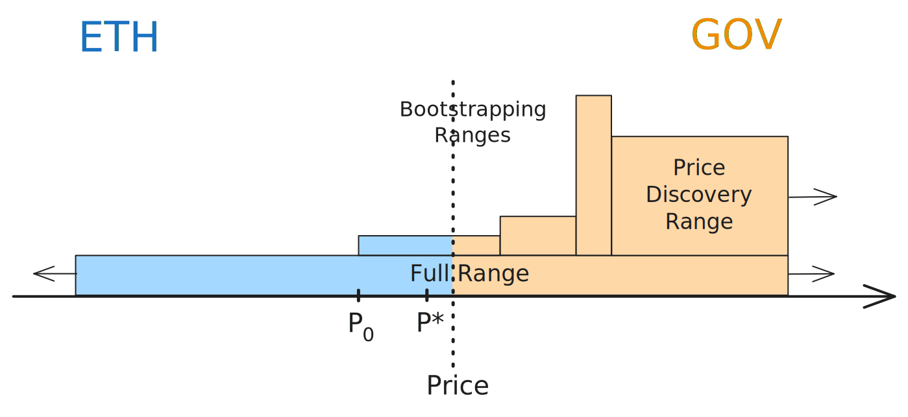
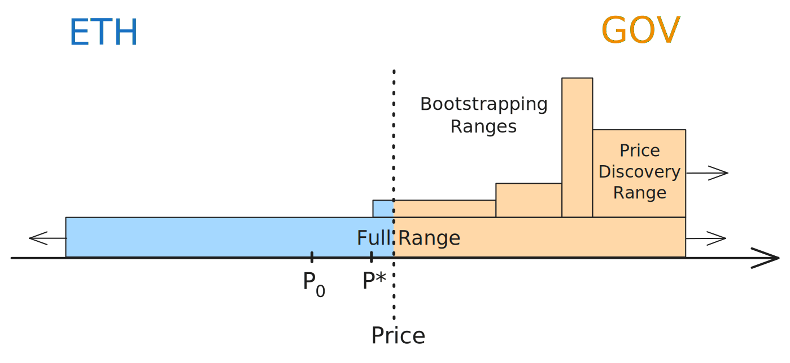

# Bootstrap strategy

## Introduction

Uniswap V2 simplicity and symmetric trading curve are ideal for price discovery during token launches. The absence of directional bias implies that trading activity orgaically determines the market price of a token. However, this requires adding liquidity in a 50/50 ratio, which is not practical for most treasuries.

Our bootstrap strategy is designed to leverage the features of concentrated liquidity introduced in Uniswap V3 in order to manage very imbalanced liquidity ratios, for example 80% of a governace token GOV vs 20% of a quote token like ETH or USDC, that progressively converge to a 50/50 ratio. This is achieved by an assymetrical absortion of the volatility, that is, actively securing more of the quote token on buy spikes.

## Implementation

The bootstrap strategy defines a liquidity distribution composed by several ranges

- **Full Range:** A wide position with both tokens in a 50/50 proportion and acting as the main stabilizer. It provides liquidiity at all possible prices and ensures trading is always possible for this pair.

- **Bootstrapping Ranges:** Short, sequential ranges with increasing size, initially holding just one token to guide early price movement. They are the core element of this strategy and built such that the price impact for buying and selling orders are very close to each other. These ranges are able to capture ETH during upside movements in price while providing an almost unbiased experience for traders.

- **Price Discovery Range:** A long-range position for capturing additional upside if price increases significantly in high volatilty scenarios.

These ranges are depicted in the image below, where we consider a quote token ETH and a base token GOV in a very imbalanced ratio. 

   

This strategy sets target prices used as a rebalance trigger. The target price on the GOV token side is set to quickly capture some of the ETH sold to the pool (called $P^*$ in the figure below).

   

This ETH is then secured in a full range position via a rebalance of all the positions, which allows to continuously converge to a 50/50 token ratio, which then allows to migrate to a more capital efficient strategy, that we call [Flagship strategy](flagship.md).

   

