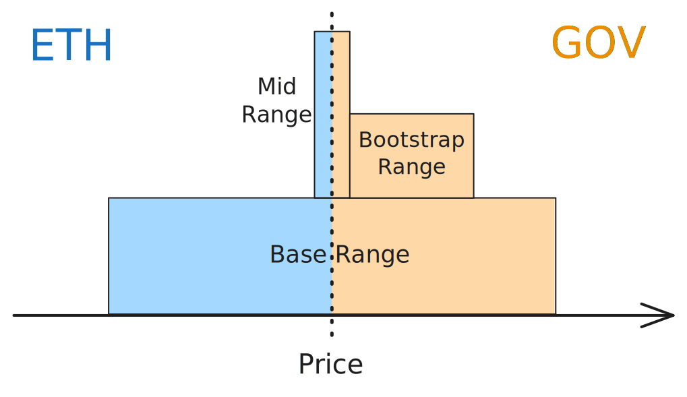

# Flagship strategy

## Introduction
The Flagship Strategy is designed to optimize liquidity across different market conditions on AMMs based on Uniswap V3 math. It reacts to price movements, inventory shifts, and market volatility using a flexible system of rules and modes to manage exposure and fee generation.

## Implementation

### Risk Modes
This strategy runs in one of three risk modes based on volatility:

- 🟢 Low volatility: Most of the liquidity is deployed to maximize trading activity and fee income.
- 🟡 Moderate volatility: Slightly reduced exposure to protect against risk.
- 🔴 High volatility: Only a portion of liquidity is deployed to minimize impermanent loss and risk.

### Liquidity Profile
Depending on the mode, the strategy builds liquidity using two or three range types:

- **Base Range:** A wide range that holds the core liquidity and allows trading of big orders with minimal price impact.
- **Bootstrapping Range:** A narrower limit-order-like position designed to maintain a 50/50 token ratio.
- **Mid Range:** A tight position around the current price that provides very deep liquidity and reduces price impact for average orders. *This is only present in the low volatility mode*.

In the figure below we show a liquidity distribution on a low volatility mode, where the token ratio is 60% GOV and 40% ETH.

   

### Rebalance triggers
- **Price Triggers:** If the price moves enough in either direction, the strategy redistributes liquidity around the new price. In balanced portfolios (e.g. 50/50 holdings), a standard threshold is used. For imbalanced portfolios, the threshold dynamically adjusts to respond more aggressively or conservatively, depending on how skewed the inventory is.

- **Inventory Triggers:** If the holdings of the two tokens shift beyond a target ratio (like 75/25), the strategy reacts. It recalculates the liquidity split and redistributes accordingly to guide the pool back toward balance.

- **Volatility Triggers:** When the market becomes too volatile, the strategy shifts risk modes, pulling back liquidity and widening ranges to reduce risk.