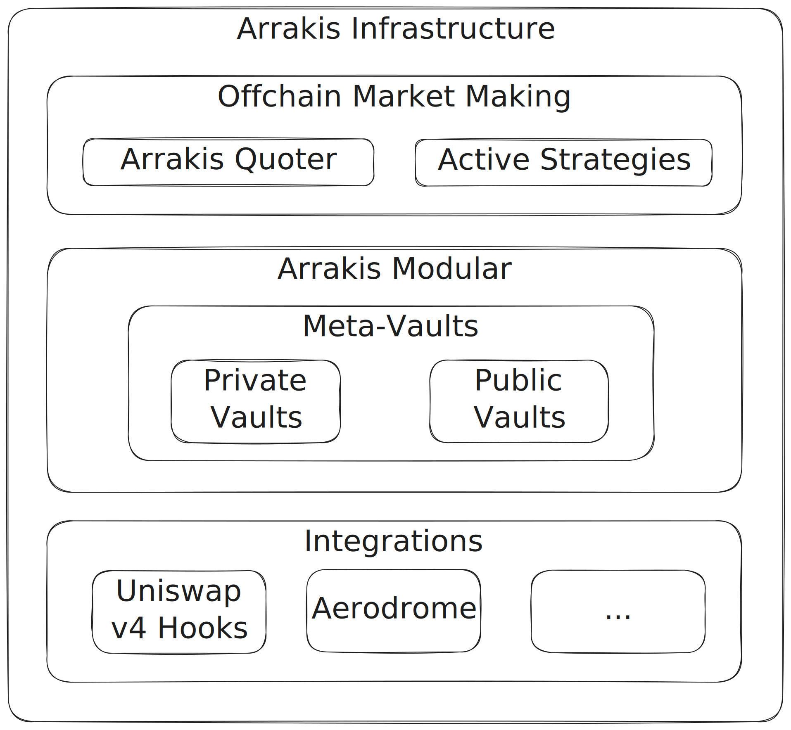

# Arrakis Infrastructure

Arrakis Infrastructure consists of two components:

- [Offchain Market Making](offchainMarketMaking.md)
- [Smart Contract Framework](smartContractFramework.md)

Together the Arrakis offchain market making and the Arrakis Modular (smart contract framework) form the Arrakis infrastructure known as the Arrakis protocol.

For example, [HOT AMM](../integrations/hotAmm.md) is formed by the following components:

- Arrakis Quoter and other offchain market making components.
- Arrakis Modular (smart contract framework) using public vaults.
- Valantis Modular DEX framework (as the 1st integration).
